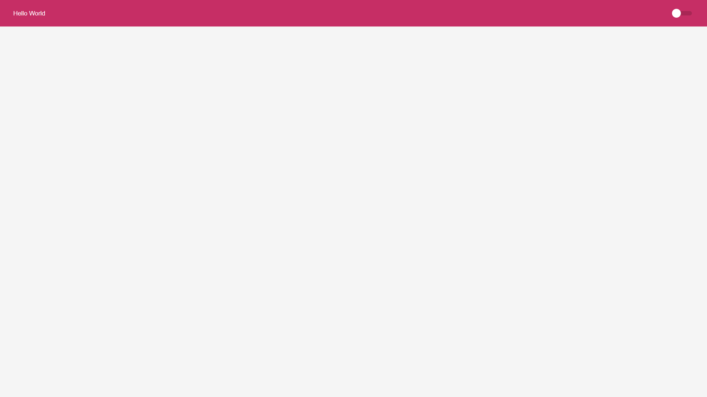
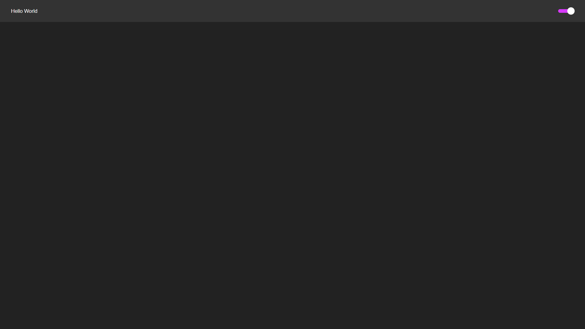

<div align="center" id="top"> 
  
</div>

<br>

## About

This application aims to change the application themes between dark and light themes according to whether the switcher is active or not. The information of the selected theme is stored in a variable named "key" in the browser's local storage, so the selected theme remains even after page updates.

## Screenshots

<div align="center" id="top"> 
  
</div>
<br/>
<div align="center" id="top"> 
  
</div>

## Features

- Alteração de temas predefinidos (dark and light).

## Technologies

The following tools were used in this project:

- [React](https://pt-br.reactjs.org/)
- [Typecript](https://www.typescriptlang.org/)
- [Styled Componensts](https://styled-components.com/)

## Requirements

Before starting 🏁, you need to have [Git](https://git-scm.com) and [Node](https://nodejs.org/en/) installed.

## Starting

```bash
# Clone this project
$ git clone https://github.com/trpiano/ThemeSwitcher

# Access
$ cd ThemeSwitcher

# Install dependencies
$ yarn
# Or
$ npm

# Run the project
$ yarn dev
# Or
$ npm start

# The server will initialize in the <http://localhost:3000>
```

Made with 💜 by <a href="https://github.com/trpiano" target="_blank">Timóteo Piano</a>

&#xa0;

<a href="#top">Back to top</a>
